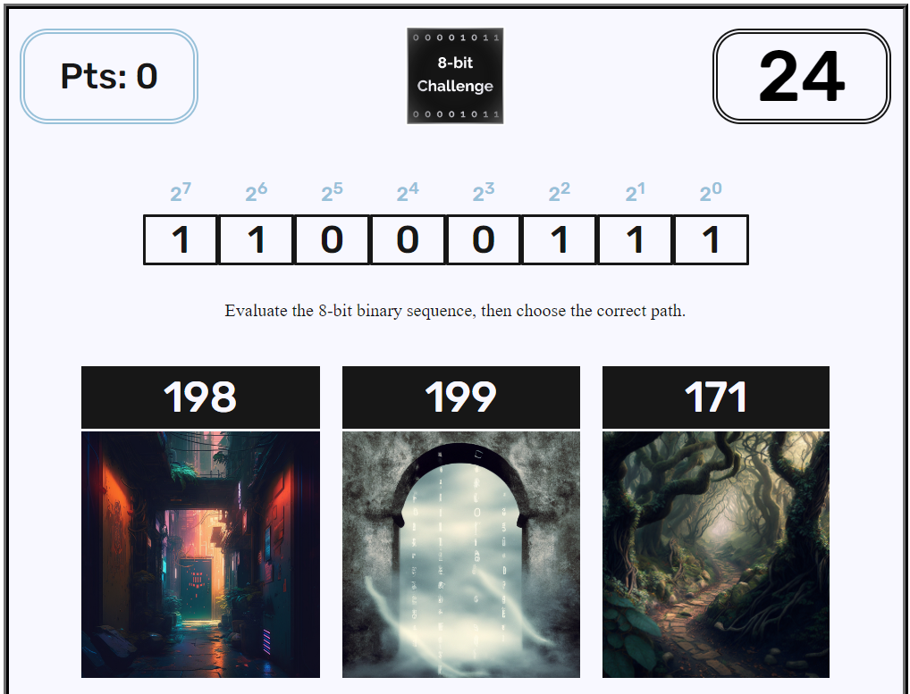

# The 8-bit Challenge

## Description

The 8-bit Challenge is an educational game that gives players an opportunity to practice converting 8-bit binary sequences to decimal numbers. The game is designed to be fun, engaging, and challenging, and it is suitable for people of all ages who are interested in learning more about binary numbers and computer science.

## Version 1.0

[eight-bit-challenge.pages.dev]('https://eight-bit-challenge.pages.dev')

## Features

- A comprehensive list of all possible 8-bit binary sequences that represent decimal numbers 0-255
- A randomly generated list of decimal numbers, each of which determines the binary sequence that is displayed and represents the correct answer choice
- Two randomly generated incorrect answer choices that make the game more challenging
- A timer that counts down the amount of time players have to answer each question
- A points system that rewards players for correct answers and tracks their progress through the game

## Contributing

If you'd like to contribute to the 8-bit Challenge, please feel free to submit a pull request or create an issue on GitHub.

## License

The 8-bit Challenge is released under the MIT License.
